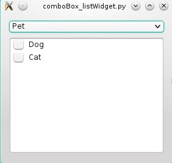

 This work is licensed under a <a rel="license" href="http://creativecommons.org/licenses/by/4.0/">Creative Commons Attribution 4.0 International License</a>.

## simple-qt-thread
Python implementation of fabienpn/simple-qt-thread-example, with Python3.4 and PyQt

Original (C++): https://github.com/fabienpn/simple-qt-thread-example

Full explanation of the C++ code:
http://fabienpn.wordpress.com/2013/05/01/qt-thread-simple-and-stable-with-sources/

## checkBoxTable

Sublass `QAbstractTable` and `QHeaderView` for a custom table with checkboxes on the left side.
In the header, checkbox allow to check/uncheck all rows.

Tested on OpenSuse with Python2.7 and Python3.4 (Anaconda)

## comboBox_listWidget

Given a dictionary:

    self.myDict={"Pet":['Dog','Cat'],"Bird":['Eagle','Jay','Falcon']}

The comboBox is populated with the keys (here, species). The list widget is
filled with the list associated to the current key (here, animal names).
Based on [my answer on Stackoverflow](http://stackoverflow.com/a/32005220/4720935)

## dateEdit

Custom `QDateEdit` which only allows a list of valid days. Displayed in US
format MM/DD/YYYY.  
Based on [my answer on Stackoverflow](http://stackoverflow.com/a/33753350/4720935)
